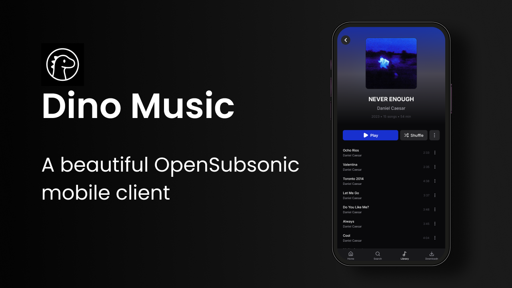

# Dino Music
Dino is a premium mobile music streaming application for iOS and Android that connects to OpenSubsonic servers. Features Tidal-inspired design with dynamic blurred backgrounds, robust offline support, intelligent queue management with server sync, synchronized lyrics, radio/instant mix, Chromecast integration, and deep linking for shared content.

> [!IMPORTANT]
> ### AI Disclosure
> This application is fully made with AI. All code, design, and implementation has been generated using artificial intelligence tools. If you dislike Vibe Coded apps, you are free to ignore this app.

## Features (Implemented)

- OpenSubsonic API integration with multi-server support
- Streaming with quality selection and smart caching
- Background playback with lock screen controls
- Search across entire library
- Favorites/starred content
- Queue management with server synchronization
- Network-adaptive streaming
- Scrobbling (play count tracking and progress updates)
- Cross-device playback continuity (resume on another device)

## Planned Features (Not Yet Implemented)

- Share feature with deep linking (Deep linking only supported with [Dinosonic](https://github.com/sonicdino/dinosonic) servers)
- Downloads and Offline Playback (individual tracks, albums, playlists)
- Synchronized lyrics as dedicated screen
- Radio/Instant Mix
- Chromecast support
- Android Auto integration
- Google Assistant voice commands

## Technology Stack

- React Native via Expo
- TypeScript for type safety
- OpenSubsonic API integration
- Premium Tidal-inspired UI with glassmorphism effects

## Getting Started

### Prerequisites

- Node.js and npm installed
- Expo CLI (`npm install -g expo-cli`)
- An OpenSubsonic server to connect to

### Installation

1. Install dependencies:
   ```bash
   npm install
   ```

2. Build development app using EAS:
   ```bash
   eas build --platform ios --profile preview
   eas build --platform android --profile preview
   ```

3. Start the app:
   ```bash
   npx expo start
   ```

Scan the QR code with your development app (built from step 2). Expo Go is not supported for this project.

## First Launch

On first launch, you'll be prompted to add your OpenSubsonic server connection. The app supports multiple servers that you can switch between at any time.

## AI-Generated Content

This entire project, including but not limited to:
- All source code
- UI/UX design
- Documentation
- Configuration files
- Build scripts

Has been generated using artificial intelligence tools without human manual coding.

---

*Built entirely with AI tools*
